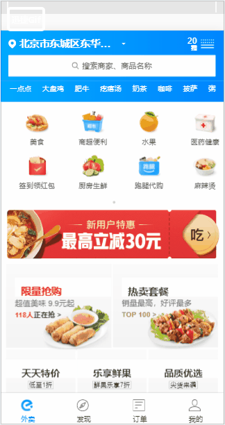
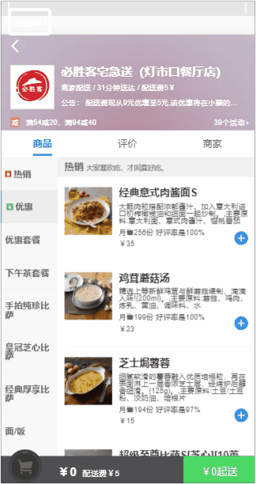

# elm_project
# 一个餐饮点餐的webApp

## 进来的首页（获取首页数据并显示）
### 1.定位功能的实现,2.天气预报实现,3.热搜关键字实现，4.食品导航入口实现，5.推荐商家实现，6.活动实现
 

## 点餐界面
### 1.组件划分：头部组件，商品组件，评价组件，店铺组件
### 2.实现弹出层组件，
### 3.商品组件中根据不同类别的食物分类对应不同的点餐食物界面，分左右两栏布局对应滚动
 

## 购物车操作
### 1.购物车列表实现，2.遮罩层的实现，3.清空购物车显示和隐藏购物车，4.小球动画实现
 
